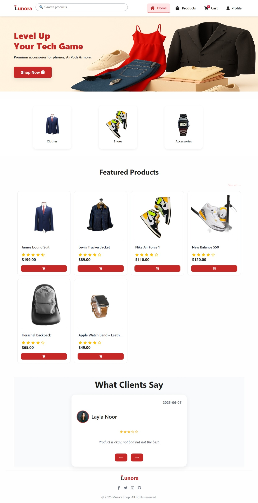
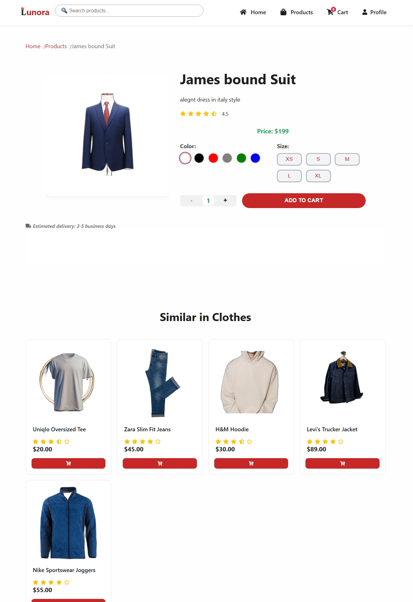

# 👗 Lunora — Fashion E-commerce Store

## 🌐 **Live Demo**
[ 👉 Click Here to View the Live Site 👈](https://mousacr7.github.io/coffee-shop-ecommerce/)

---

Welcome to **Lunora**, a modern, responsive, and minimalistic fashion e-commerce web app designed to showcase products with style and usability.

---

## ✨ Features

- 🛍️ Beautiful hero section with featured products
- 👠 Product catalog with filters (category, color, price)
- 🖼️ Quick view modal for each product
- 🛒 Add to cart with quantity control
- 💬 Responsive design for mobile/tablet/desktop
- 🔍 Search functionality
- 📦 Cart badge synced across the UI
- ⚙️ Built for future enhancements (login, Firebase, etc.)

---

## ⚙️ Tech Stack

- **React** + **React Router**
- **CSS** (custom-tailored design system)
- **JavaScript** (modular product logic)
- **React Icons**
- **LocalStorage** (cart persistence)

---

## 💡 Design Concept

The concept behind Lunora is clean elegance — a white + beige theme inspired by minimalist boutiques. The layout emphasizes:
- Negative space for product focus
- Large, sharp visuals
- Soft shadows and gentle transitions

---

## 🚀 How to Run Locally

git clone https://github.com/YOUR_USERNAME/lunora.git
cd lunora
npm install
npm start

👨‍🎨 Author
Musa Mlam Al Brnawi
Frontend Developer — React | Firebase | UI/UX

📫 [Fiverr Profile](https://www.fiverr.com/s/yvaRpbb)
🌐 [Upwork Profile](https://www.upwork.com/freelancers/~01fc5fdd695c924d11)

📌 Client Note
This project showcases a high-end design approach for modern e-commerce. It’s ideal for boutiques, clothing brands, or any business seeking a polished online presence.

📄 License
This project is free to use for learning, portfolio, and non-commercial purposes.